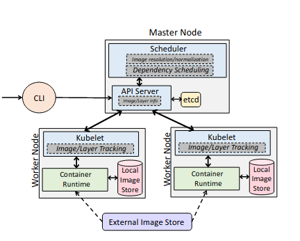
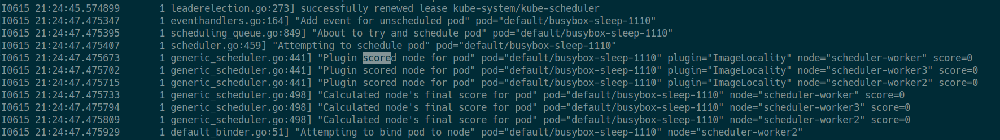

# kind-image-locality-demo

na podstawie [artykułu](https://www.usenix.org/system/files/hotedge20_paper_fu.pdf) - _"Fast and Efficient Container Startup at the Edge via Dependency Scheduling"_

[repozytorium](https://github.com/m00lecule/kind-image-locality-demo) zawierające manifesty na potrzeby ćwiczenia 

## requirements
- kind    `0.11.0`
- docker  `20.10.7`
- kubectl `1.17.3`

# wstęp

Podstawowym zamysłem konteneryzacji jest umieszczenie aplikacji, jej procesów, konfiguracji i zależności w wirtualnej jednostce zwanej kontenerem. Z punktu widzenia aplikacji, kontenery te są odrębnymi i niezależnymi instancjami środowiska uruchomieniowego. 


Podstawową zależnością wymaganą do uruchomienia kontenera jest jego **obraz**, przechowywany w lokalnym systemie plików. Obrazy bazują na **union file system**, gdzie każda warstwa enkapsuluje zbiór plików i katalogów, które są wymagane przez kontener w momencie startu. Warstwy są identyfikowane przez **digest** - hash z zawartości plików w warstwie. Ten mechanizm umożliwia zmianę nazwy obrazu, bez inwalidacji cachowanych dotąd plików - co jest dobrą praktyką w redukowaniu wielkości redundantnych plików oraz niepotrzebnych pobrań.


Kubernetes umożliwia kontrolę dużej liczby instancji skonteneryzowanych aplikacji. Problem pojawia się jednak w sytuacji, kiedy mamy wiele kontenerów, a ograniczoną liczbę workerów, lub poszczególne kontenery nie obciążają w równym stopniu poszczególnych node-ów. W przypadku wystąpienia takiej sytuacji, następuje zmiana kontekstu, tzn. wykorzystanie noda, przez inny kontener. Operacje zmiany kontekstu są drogie. Zwykle wymaga ona przeładowania wszystkich zależności. Zdarzają się jednakże sytuacje, kiedy więcej niż jeden kontener wykorzystuje ten sam obraz systemu. Załóżmy zatem, że mamy 2 nody (A B) oraz 5 kontenerów posiadających kolejno obrazy (a a a b b). Ponadto upraszczając, każdy z kontenerów wykorzystuje taką samą ilość zasobów. W sytuacji następującej:

```
A -> a b a
B -> a b
```

mamy aż **5** ładowań środowiska oraz **4** oczekiwania na pobranie obrazów.

Bardzo często będzie to wymagało pobrania zależności z jakiegoś serwera, co dodatkowo wydłuży czas. Jeżeli natomiast posegregowali byśmy zadania w następujący sposób:

```
A -> a a a
B -> b b
```

uzyskujemy dalej **5** ładowania środowiska oraz _zaledwie_ **2** pobrania obrazów.

Funkcjonalność ta została zaimplementowana w związku z popytem na technologie typu **serverless** - [AWS Lambda](https://aws.amazon.com/blogs/compute/container-reuse-in-lambda/), gdzie unikanie niepotrzebnych pobrań może zaoszczędzić tysiące dolarów poprzez oszczędne wykorzystanie storage'u oraz redukcje wielkości ruchu sieciowego. Dodatkowo zadania tego typu cechują się _krótkim czasiem wykonania_ - często przygotowanie środowiska trwa dłużej niż samo wykonanie.

W ramach ćwiczenia należy dokonać analizy dostępnych rozwiązań przydziału zasobów na lokalnym środowisku.

# `ImageLocality`

Wraz z [MR](https://github.com/kubernetes/kubernetes/pull/68081) została dodana do domyślnego schedulera polityka - `ImageLocality`, która faworyzacje nody, posiadające lokalnie wymagane zależności Poda- w celu zmiejszenia overheadu związanego ze pobraniem konteneru podczas startu.

Do komponentów systemowych kubernetesa zostały wprowadzone następujące zmiany:



**kubelet** - jego funkcjonalność została rozszerzona o moduł, którego zadaniem jest logowanie informacji o warstwach/obrazach na worker nodach. Digest oraz rozmiary warstw są cyklicznie komunikowane do API-Servera. W przypadku przepełnienia filesystemu na nodzie, jego zadaniem jest usunięcie nadmiarowych obrazów.

**API-Server** - został rozszerzony o możliwość wykonania RPC, dzięki czemu kubelet, może persystować informacje o stanie obrazów i warstw w nodach w etcd.

**scheduler** - implementuje dodatkowy plugin, który wykonuje dwie niestandardowe operacje:

- mapowanie kolejkowanego poda na warstwy jego obrazu oraz digest - informacje o każdym obrazie są cachowane. Zbieranie takich informacji odseparowywuje problem od nazwy obrazu - potencjalnie obraz o takiej samej zawartości może zawierać kilka aliasów
- selekcja node’a, który posiada jak największy podzbiór (pod względem rozmiaru na dysku) pasujących warstw. 

## cel projektu

Naszym zadaniem będzie przetestowanie możliwości własnej konfiguracji polityki schedulera - poda z przestrzeni nazw `kube-system`, którego zadaniem jest dopisanie do nowo utworzonego manifestu poda informacji o tym na jakim nodzie ma zostać wykonany. W przypadku braku tej etykiety będzie wisiać ciągle w stanie `Pending`.

```diff
spec:
  containers:
  (...)
+  nodeName: scheduler-worker2
+  schedulerName: default-scheduler
```

W przypadku manifestu w którym brakuje etykiety `schedulerName` domyślnie zostanie przypisany systemowy scheduler - `default-scheduler`.

> Zadaniem schedulera jest na podstawie danych zebranych z nodów, dodać etykiete `nodeName` - zawierającą informację na którym nodzie ma wykonać się pod.

## polityki

Nody dla podów przydzielane są na podstawie punktacji, która scheduler wylicza. W skład punktacji wchodzą: indywidualne i zbiorowe wymagania dotyczące zasobów, ograniczenia sprzętowe, oprogramowanie, lokalizacje danych oraz zakłócenia między obciążeniami i tak dalej. Odbywa się to w 2 krokowej operacji: `Filtering` oraz `Scoring`.
Etap filtrowania szuka zestaw nodów, do których można zaaplikować poda. Jeśli lista węzłów po filtrowaniu jest pusta to w tym momencie nie można zaaplikować nigdzie noda. Następnie jest realizowany etap wyceniania, który porządkuje tą listę wyceniając każdego noda. Następnie pod jest przypisywany do węzła o najwyższej wycenie.
Istnieją dwa sposoby na konfiguracje zachowania etapów:

- `Scheduling Policies` -  pozwala na konfiguracje predykatów dla filtrowania oraz priorytetów dla wyceny.
- `Scheduling Profiles` - pozwala na konfiguracje pluginów, które implementują dodatkowe etapy.


Domyślnie scheduler oblicza score każdego noda na podstawie następujących [kryteriów](https://kubernetes.io/docs/reference/scheduling/policies/), jednak my zajmiemy się jednym z nich a mianowicie:

> **ImageLocalityPriority**: faworyzuje nody, które mają lokalnie zaciągnięte obrazy kontenerów


### manifesty podów z `kube-system` ns
Manifesty podów systemowych znajdują się w katalogu `/etc/kubernetes/manifests` na master nodach

`kind` umożliwia edycję tego manifestu za pomocą definicji manifestu klastra

```diff
$ cat manifests/cluster-config.yaml
(...)
nodes:
  - role: control-plane
    kubeadmConfigPatches:
      - |
        kind: ClusterConfiguration
        scheduler:
          extraArgs:
+            config: /etc/kubernetes/scheduler-config.conf
+            v: '15'
          extraVolumes:
            - name: configuration
              hostPath: /etc/kubernetes/scheduler-config.conf
              mountPath: /etc/kubernetes/scheduler-config.conf
              readOnly: true
              pathType: File
(...)
```

Należy tutaj zwrócić uwagę na dwa pola:
 - `v`(erbose) - w celu wyświetlenia wartości score dla poda należy zwięszkyć poziom logowania `kube-schedulera` do 15
 - `config` - scieżka do manifestu zawierającego zasób `KubeSchedulerConfiguration`, który umożliwi nam konfiguracje polityki schedulowania

### `KubeSchedulerConfiguration`
 Jest abstrakcyjnym zasobem, umożliwiającym kontrolę kryteriów algorytmu liczącego score dla Noda. W naszym przypadku chcemy wyłączyć wszystkie domyślne kryteria oraz pozostawić jedynie `ImageLocality` z wysokim współczynnikiem. Jego definicja docelowo ma znaleźć się pod ścieżką `/etc/kubernetes/scheduler-config.conf` na master nodzie.

```diff
kind: KubeSchedulerConfiguration
percentageOfNodesToScore: 100
profiles:
  - schedulerName: default-scheduler
    plugins:
      score:
+       disabled:
+         - name: '*'
+       enabled:
+         - name: ImageLocality
+           weight: 1000
```

# demo

Poniższe ćwiczenie będziemy przeprowadzać na [kindzie](https://kind.sigs.k8s.io/docs/user/quick-start/). Jest to narzędzie stawiające lokalny klaster kubernetesa bazujący na obrazach dockerowych.

Pobierz repozytorium:
```zsh
git clone https://github.com/m00lecule/kind-image-locality-demo.git
```

## Utworzenie klastra

```zsh
kind create cluster --name scheduler --config=manifests/cluster-config.yml
```

Poprawnie stworzony klaster wygląda następująco:

```zsh
$ kind get clusters
scheduler
$ kubectl get nodes -o wide
NAME                      STATUS   ROLES                  AGE   VERSION   OS-IMAGE       KERNEL-VERSION     CONTAINER-RUNTIME
scheduler-control-plane   Ready    control-plane,master   32m   v1.21.1   Ubuntu 20.10   5.8.0-59-generic   containerd://1.5.1
scheduler-worker          Ready    <none>                 31m   v1.21.1   Ubuntu 20.10   5.8.0-59-generic   containerd://1.5.1
scheduler-worker2         Ready    <none>                 31m   v1.21.1   Ubuntu 20.10   5.8.0-59-generic   containerd://1.5.1
scheduler-worker3         Ready    <none>                 31m   v1.21.1   Ubuntu 20.10   5.8.0-59-generic   containerd://1.5.1
```

```yaml
kind: Cluster
apiVersion: kind.x-k8s.io/v1alpha4
nodes:
  - role: control-plane
  (...)
  - role: worker
  - role: worker
  - role: worker
```

W tej konfiguracji stworzony klaster posiada  następującą konfigurację:
- 3 worker node'y dla pozostałych przestrzenii nazw
- 1 master node o nazwie `scheduler-control-plane` - wykonywane na nim są kontenery z przestrzeni `kube-system` (oprócz kube-proxy oraz CNI)
  - apiserver - centralne API klastra
  - control-manager - control loop, którego zadaniem jest wprowadzanie zmian w celu utrzymania spójności z zaratościa etcd 
  - coredns - DNS discovery
  - scheduler - przydział podów na nody
  - etcd - storage przechowywujący stan całego klastra
  - kindnet - CNI (DaemonSet)
 
```zsh
kubectl get pods -n kube-system -o wide
NAME                                              READY   STATUS    RESTARTS   AGE    IP           NODE                      NOMINATED NODE   READINESS GATES
coredns-558bd4d5db-4dtv4                          1/1     Running   0          124m   10.244.0.2   scheduler-control-plane   <none>           <none>
coredns-558bd4d5db-86vwx                          1/1     Running   0          124m   10.244.1.2   scheduler-worker          <none>           <none>
etcd-scheduler-control-plane                      1/1     Running   0          124m   172.25.0.5   scheduler-control-plane   <none>           <none>
kindnet-9gfqw                                     1/1     Running   0          123m   172.25.0.3   scheduler-worker3         <none>           <none>
kindnet-b6zjz                                     1/1     Running   0          123m   172.25.0.2   scheduler-worker2         <none>           <none>
kindnet-btjds                                     1/1     Running   0          123m   172.25.0.4   scheduler-worker          <none>           <none>
kindnet-xq77n                                     1/1     Running   0          124m   172.25.0.5   scheduler-control-plane   <none>           <none>
kube-apiserver-scheduler-control-plane            1/1     Running   0          124m   172.25.0.5   scheduler-control-plane   <none>           <none>
kube-controller-manager-scheduler-control-plane   1/1     Running   0          124m   172.25.0.5   scheduler-control-plane   <none>           <none>
kube-proxy-b5tjz                                  1/1     Running   0          123m   172.25.0.2   scheduler-worker2         <none>           <none>
kube-proxy-gds46                                  1/1     Running   0          123m   172.25.0.3   scheduler-worker3         <none>           <none>
kube-proxy-nlr6s                                  1/1     Running   0          123m   172.25.0.4   scheduler-worker          <none>           <none>
kube-proxy-nn64s                                  1/1     Running   0          124m   172.25.0.5   scheduler-control-plane   <none>           <none>
kube-scheduler-scheduler-control-plane            1/1     Running   4          121m   172.25.0.5   scheduler-control-plane   <none>           <none>
```
 Warto też zauważyć że w przypadku tego klastra naszym runtime'em kontenerowym (kolumna CONTAINER-RUNTIME) jest `containerd`. Rzutuje to na drobne zmiany m.in: socket do komunikacji z kenrnelem znajduje się pod ścieżką `/run/containerd/containerd.sock` a z poziomu cli będziemy wchodzić z interakcję za pomocą komendy `crictl`.

W celu wypisania wszystkich obrazów znajdujących się w kontenerze worker nodzie klastra - `schduler-worker` należy wykonac polecenie:
```zsh
$ docker exec -it scheduler-worker crictl images
IMAGE                                      TAG                  IMAGE ID            SIZE
docker.io/kindest/kindnetd                 v20210326-1e038dc5   6de166512aa22       54MB
docker.io/rancher/local-path-provisioner   v0.0.14              e422121c9c5f9       13.4MB
k8s.gcr.io/build-image/debian-base         v2.1.0               c7c6c86897b63       21.1MB
k8s.gcr.io/coredns/coredns                 v1.8.0               296a6d5035e2d       12.9MB
k8s.gcr.io/etcd                            3.4.13-0             0369cf4303ffd       86.7MB
k8s.gcr.io/kube-apiserver                  v1.21.1              6401e478dcc01       127MB
k8s.gcr.io/kube-controller-manager         v1.21.1              d0d10a483067a       121MB
k8s.gcr.io/kube-proxy                      v1.21.1              ebd41ad8710f9       133MB
k8s.gcr.io/kube-scheduler                  v1.21.1              7813cf876a0d4       51.9MB
k8s.gcr.io/pause                           3.4.1                0f8457a4c2eca       301kB
```

Następnie należy przekopiwać do mastera naszą nową konfigurację schedulera

```zsh
docker cp manifests/scheduler-config.conf scheduler-control-plane:/etc/kubernetes/scheduler-config.conf
```

oraz usunąć obecnego schedulera, w celu zaczytania nowej konfiguracji:

```zsh
kubectl delete pod kube-scheduler-scheduler-control-plane -n kube-system 
```

Aby przetestować poprawność działania obecnej konfiguracji należy utworzyć kilka podów, bazujących na obrazie `busybox`

```zsh
$ kubectl apply -f manifests/busybox-pod.yaml
pod/busybox-sleep-0 changed
```
następnie edytować pole `metadata.name` na przykładowo `busybox-sleep-11100`. Operację powtórzyć kilkukrotnie, aby końcowo uzyskać kilka podów z identycznym obrazie w manifeście: 

```zsh
$ kubectl get pods -o wide
NAME                  READY   STATUS    RESTARTS   AGE   IP           NODE                NOMINATED NODE
busybox-sleep-0       1/1     Running   0          67m   10.244.2.3   scheduler-worker2   <none> 
busybox-sleep-1110    1/1     Running   0          67m   10.244.2.2   scheduler-worker2   <none> 
busybox-sleep-11100   1/1     Running   0          13s   10.244.3.3   scheduler-worker3   <none> 
```

weryfikacja obrazu na workernodach:
```zsh
$ docker exec -it scheduler-worker2 crictl images | grep busybox
docker.io/library/busybox                  latest               69593048aa3ac       771kB
$ docker exec -it scheduler-worker3 crictl images | grep busybox
docker.io/library/busybox                  latest               69593048aa3ac       771kB
$ docker exec -it scheduler-worker crictl images | grep busybox 
```

## logowanie score per node

```zsh
kubectl logs kube-scheduler-scheduler-control-plane -n kube-system -f
```

Na poniższym zrzucie ekranu widać że scheduler zaczytał poprawnie nową konfigurację - w którym jedyną metryką jest `ImageLocality` jednak liczy dla niego niepoprawną wartość score - dla każdego noda jest równa `0`.


### Powodem niepowodzenia mogą być następujące czynniki 
Za zbieranie informacji o lokalnych obrazach na worker nodach odpowiada moduł zaimplementowany w  `kubelecie`. `kind` implementuje `kubeleta` w uboższej konfiguracji - nie posiada tej funkcjonalności. Argumentem za taką decyzją był fakt, iż kontenery są to fizczynie procesy, które współdzielą ze sobą kernel - w którym znajduje się tylko jeden runtime kontenerowy. `kind` jest narzędziem, które ma tworzyć klaster działający w ramach jednego wspóldzielonego kernela, fizycznie `containerd` nie jest instalowany wewnątrz każdego kontenera, tylko jest strzykiwany poprzez `socket` - `/run/containerd/containerd.sock` który wchodzi w interakcję z właściwym demonem z kernela, więc koniec końców wszystko i tak pozostaje lokalnie.

# kontynuacja

W zaistniałej sytuacji chcemy zaproponować następujący workaround - DaemonSet, który będzie cykliczne monitorował stan kontenerów `kinda` oraz logował te informacje do `etcd`.

Przykładowy manifest:

```diff
apiVersion: apps/v1
kind: DaemonSet
metadata:
  labels:
    name: rancher-crictl
  name: rancher-crictl
spec:
  selector:
    matchLabels:
      name: rancher-crictl
  template:
    metadata:
      labels:
        name: rancher-crictl
    spec:
      volumes:
        - name: cri-sock
          hostPath:
            path: "/run/containerd/containerd.sock"
      containers:
        - name: rancher-crictl
          image: rancher/crictl:v1.19.0
          command: [ "/bin/bash", "-c", "--" ]
+         args: [ "while true; do crictl images ls; done;" ]
          securityContext:
            privileged: true
          volumeMounts:
+           - mountPath: /run/containerd/containerd.sock
              name: cri-sock
              readOnly: false
```

Zwrócić w nim należy na dwie ważne sekcje - przekazanie do wnętrza kontenera socketu z worker node'a oraz cyklicznie wypisywanie na stdout listy dostępnych lokalnie obrazów kontenerów.

# Autorzy

- Michał Dygas
- Andrzej Kołodziej
- Marcin Hajdo
- Tomasz Markiewicz
- Wojtek Rębisz